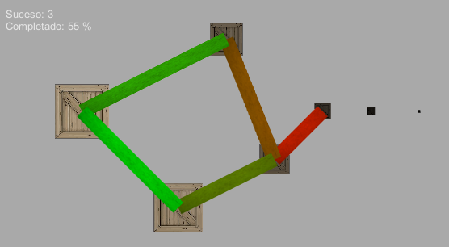
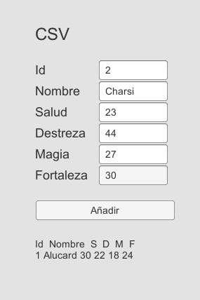

===================
Almacenamiento
===================

Player Prefs
===============

Es una forma muy sencilla de guardar datos entre sesiones. Utiliza el sistema (clave, valor) por lo que es útil para datos simples como puntuaciones, vidas, nivel desbloqueado, dificultad, idioma, etc. aunque para datos más complejos es preferible utilizar otro tipo de almacenamiento.

Sintaxis en Unity
-------------------

Cargar

.. code-block:: c#

    PlayerPrefs.GetInt("puntuacion");
    // GetInt, GetFloat, GetString

Guardar

.. code-block:: c#

    PlayerPrefs.SetInt("puntuacion", puntos);
    // SetInt, SetFloat, SetString

Guardar todo

.. code-block:: c#

    PlayerPrefs.Save();

Borrar

.. code-block:: c#

    PlayerPrefs.DeleteKey("puntuacion");

Borrar todo

.. code-block:: c#

    PlayerPrefs.DeleteAll();

Implementación en Unity
---------------------------

.. code-block:: c#

    public void guardarPartida(){
        if(PlayerPrefs.GetInt ("nivelDesbloqueado") < nivel)
            PlayerPrefs.SetInt("nivelDesbloqueado", nivel);
        if(PlayerPrefs.GetInt ("puntosMax") < puntos) 
            PlayerPrefs.SetInt("puntosMax", puntos);
        }

    public void cargarPartida(){
        nivel = PlayerPrefs.GetInt("nivelDesbloqueado");
        puntos = PlayerPrefs.GetInt("puntosMax");
        }

Ficheros XML
================

Formato estructurado por etiquetas en las que el contenido puede ir en forma de atributos o valores internos. Los ficheros tienen una estructura de tipo árbol que puede procesarse de varias formas: (1) procesado DOM, cargando el documento en memoria y accediendo a los elementos que necesitemos mediante un lenguaje llamado xpath o (2) procesado SAX, en órden secuencial.

Estos ficheros suelen validarse en dos etapas: (1) si cumplen con la sintaxis del lenguaje de marcado y (2) si cumplen con la estructura que nosotros hemos definido para el documento (la cuál tendremos que definir en un XMLSchema o DTD).

Fichero de ejemplo
-----------------------

Grafo

.. code-block:: XML

    <?xml version="1.0" encoding="UTF-8"?>
    <grafo>
        <sucesos>
            <suceso id="0">
                <x>0</x>
                <y>5</y>
                <comp>100</comp>
            </suceso>
            ...
        </sucesos>

        <actividades>
            <actividad id="A">
                <origen>0</origen>
                <destino>1</destino>
                <comp>100</comp>
            </actividad>    
            ...
        </actividades>
    </grafo>

Sintaxis en Unity
-------------------

Librerias

.. code-block:: c#

    using System.Text;
    using System.Xml;
    using System.IO;

Fichero

.. code-block:: c#

    public TextAsset fichero;

Carga

.. code-block:: c#

    XmlDocument xmlDoc = new XmlDocument();
    xmlDoc.LoadXml(ficheroXML.text);

Lectura

.. code-block:: c#

    // Seleccionar nodos
    XmlNodeList <- GetElementsByTagName(etiqueta)
    XmlNodeList <- SelectNodes(xpath)
    XmlNode <- SelectSingleNode(xpath)

    // Leer valor de atributo o elemento
    nodo.Attributes["nombre de atributo"].Value;
    nodo.SelectSingleNode("nombre de etiqueta").InnerText;

Escritura

.. code-block:: c#

    XmlElement elemento = xmlDoc.CreateElement(etiqueta);

.. code-block:: c#

    // añadir atributos
    elemento.SetAttribute(nombre,valor);

    // añadir nodos
    XmlNode nodotemp = xmlDoc.CreateElement(etiqueta);
    nodotemp.InnerText = valor;
    elemento.AppendChild(nodotemp);
    padre.AppendChild(elemento);

    // guardamos el documento
    xmlDoc.Save(getPath() + "/fichero.xml");

Implementación en Unity
-------------------------

.. code-block:: c#

    using System.Text;
    using System.Xml;
    using System.IO;

    public TextAsset ficherosDatos; 

    XmlDocument xmlDoc = new XmlDocument();
    xmlDoc.LoadXml(ficheroDatos.text);
    XmlNodeList nodos = null;

Lectura de Sucesos

.. code-block:: c#

    nodos = xmlDoc.GetElementsByTagName("suceso");

.. code-block:: c#

    //recorro
    for(int i=0; i<nodos.Count; i++){

        //extraigo info del xml
        id = int.Parse(nodos[i].Attributes["id"].Value);
        x = float.Parse(nodos[i].SelectSingleNode("x").InnerText);
        y = float.Parse(nodos[i].SelectSingleNode("y").InnerText);
        comp = float.Parse(nodos[i].SelectSingleNode("comp").InnerText);

        //almaceno
        go = (GameObject) Instantiate(prefabSuceso, new Vector2(x,y), Quaternion.identity);
        go.GetComponent<Suceso>().asigna (id, new Vector2(x,y),comp);   
    }

Lectura de Actividades

.. code-block:: c#

    nodos = xmlDoc.GetElementsByTagName("actividad");

.. code-block:: c#

    //recorro
    for(int i=0; i<nodos.Count; i++){

        //extraigo info del xml
        idstr = nodos[i].Attributes["id"].Value;
        origen = int.Parse(nodos[i].SelectSingleNode("origen").InnerText);
        destino = int.Parse(nodos[i].SelectSingleNode("destino").InnerText);
        comp = float.Parse(nodos[i].SelectSingleNode("comp").InnerText);

        //almaceno
        go = (GameObject)Instantiate (prefabActividad);
        go.GetComponent<Actividad>().asigna (idstr,
            GameObject.Find("s"+origen.ToString()),
            GameObject.Find("s"+destino.ToString()),
            comp);
        }

Ficheros CSV
=============

Formato estructurado basado en texto plano. Usualmente separamos cada entrada por líneas y dentro de cada línea los campos separados por comas (aunque podemos usar otros carácteres de separación).

Fichero de ejemplo
--------------------

Características de personajes

.. code-block:: java

    Id, Nombre, Salud, Destreza, Magia, Fortaleza
    1, Alucard, 30, 22, 18, 24 
    2, Charsi, 20, 42, 38, 18 
    3, Faris, 26, 34, 36, 22

Sintaxis en Unity
------------------

Librerías

.. code-block:: c#

    using System.IO;

Fichero

.. code-block:: c#

    public TextAsset fichero;

Lectura

.. code-block:: c#

    // Lectura de lineas
    char separadorLinea = '\n';
    string[] lineas = fichero.text.Split (separadorLinea);

    // Lectura de campos
    char separadorCampo = ',';
    string[] campos = lineas[fila].Split(separadorCampo);

    // Lectura de valor
    campos[col]; //para cadenas
    int.Parse (campos[col]);
    float.Parse (campos[col]);

Escritura

.. code-block:: c#

    File.AppendAllText(path, contenido);

Implementación en Unity
-------------------------

Lectura

.. code-block:: c#

    public TextAsset[] ficherosCSV; 

.. code-block:: c#

    public void cargarCSV(TextAsset fichero) {
        char separadorLinea = '\n';
        char separadorCampo = ',';

        // Proceso el fichero. Traigo todas las lineas
        string[] lineas = fichero.text.Split (separadorLinea);
        string[] campos;

        // Las recorro campo a campo
        for(int fila = 0; fila < lineas.Length-1; fila++){
            campos = lineas[fila].Split(separadorCampo);
            for(int col = 0; col < campos.Length; col++){
                nivel[fila][col] = int.Parse (campos[col]);
            }
        }
    }

Escritura

.. code-block:: c#

    public void escribirFichero() {
        // anadimos los registros actuales al fichero
        File.AppendAllText(Application.dataPath + "/" + ficheroCSV.name + ".csv",
            separadorLinea + 
            id.text + separadorCampo + nombre.text + separadorCampo + 
            salud.text + separadorCampo + dextreza.text + separadorCampo + 
            magia.text + separadorCampo + fortaleza.text);
    }

Ficheros Binarios
===================

Permiten guardar contenido en un fichero de forma binaria, por lo que debemos conocer la estructura para poder tanto guardar como recuperar los datos. Al proceso de pasar datos de memoria a disco se le llama serializado y al proceso inverso deserializado.

Sintaxis
--------------

Librerías

.. code-block:: c#

    using System;
    using System.Runtime.Serialization.Formatters.Binary;
    using System.IO;

Lectura

.. code-block:: c#

    BinaryFormatter bFormatter = new BinaryFormatter();
    FileStream file = File.OpenRead(ruta);
    string datos = bFormatter.Deserialize(file) as string;
    file.Close ();

Procesamiento

.. code-block:: c#

    // Lectura de lineas
    string[] lineas = fichero.text.Split (separadorLinea);

    // Lectura de campos
    string[] campos = lineas[fila].Split(separadorCampo);

    // Lectura de valor
    campos[col]; //para cadenas
    int.Parse (campos[col]);
    float.Parse (campos[col]);

Escritura

.. code-block:: c#

    BinaryFormatter bFormatter = new BinaryFormatter();
    FileStream file = File.Create(ruta);
    bFormatter.Serialize (file, cadena);
    file.Close ();

Enlaces
=========

- `Implementación <https://github.com/blancobc>`_
- `Player Prefs <http://docs.unity3d.com/540/Documentation/ScriptReference/PlayerPrefs.html>`_
- `XML w3schools <http://www.w3schools.com/xml/>`_
- `XML Parser <http://www.theappguruz.com/blog/unity-xml-parsing-unity>`_
- `CSV Parser <http://www.theappguruz.com/blog/unity-csv-parsing-unity>`_