=================================
Realidad virtual con Cardboard
=================================

Configuración del entorno para aplicaciones Android
=================================================================

Comenzaremos configurando un entorno básico de desarrollo para Android, comprobando que podemos compilar y ejecutar correctamente una aplicación en nuestro dispositivo móvil. 

Instalación de Android Studio
---------------------------------

Aunque posteriormente sólo necesitaremos tener instalado el SDK de Android, vamos a instalar Android Studio, ya que con él instalará todas las librerías necesarias (JDK, etc). 

Seleccionaremos los paquetes a instalar. En principio necesitaremos el 4.4 Kit Kat (API 19), ya que es la mínima para Cardboard y nos daría compatibilidad con más del 70% de dispositivos. Adicionalmente podemos instalar los más recientes.
`<https://developer.android.com/studio/index.html>`_

Configuración de nuestro terminal
---------------------------------------

Debemos activar el modo de desarrollo de nuestro terminal.

- Settings > About device > Build number (pulsar varias veces)
- Settings > Developer options (marcar depuración por USB)

Aplicación de prueba
----------------------

Iniciaremos la creación de un nuevo proyecto.

- Seleccionaremos la versión 4.4 Kit Kat (API 19).
- Seleccionamos una plantilla de ejemplo, por ejemplo una Basic Activity.

Una vez cargado el proyecto, se irá compilando en segundo plano y sólo tendremos que ir a la ejecución mediante Run -> Run App o con el botón de Play.

Es posible que nos de algún error debido al instant run. Lo podríamos instalar, pero como es algo que no vamos a necesitar posteriormente, lo más rápido es desactivarlo desde Preferences -> Build, execution, deployment -> Instant Run.

Nuestro terminal móvil deberá aparecer en la lista de posibles destinos siempre que esté conectado con el cable USB y tenga activados el modo de desarrollo y la depuración por USB.

Procedemos a desplegarlo en nuestro dispositivo y adicionalmente podemos probar su ejecución en los emuladores proporcionados.

Si nos falta alguna librería adicional, nos la pedirá durante el proceso y podremos instalarla.
 

Configuración del entorno para aplicaciones Cardboard desde Unity 
==================================================================

Realizaremos un proyecto en Unity donde cargaremos una demo de las librerías oficiales de GoogleVR, configuraremos el entorno, comprobaremos su ejecución en el editor y su compilación y despliegue en el dispositivo Android.

Descargamos Unity y lo instalamos marcando el componente "Android Build Support" `<https://unity3d.com/get-unity/download>`_

Comenzaremos abriendo Unity y creando un nuevo proyecto, con las librerías necesarias y preparado para compilar correctamente para la plataforma de destino, Android con Cardboard. 

- Nuevo proyecto, 3d, sin importar paquetes.
- Guardamos la escena actual, por ejemplo como main.
- Bajamos el paquete GoogleVRForUnity
    - `<https://developers.google.com/vr/develop/unity/get-started?hl=es>`_
    - `<https://github.com/googlevr/gvr-unity-sdk/releases>`_
- Importamos el paquete GoogleVRForUnity
- Abrimos la escena GoogleVR > Demos > Scenes > GVRDemo
- Configuramos los Build settings (en el menu File)
    - Añadir escenas actuales
    - Cambiar plataforma a Android

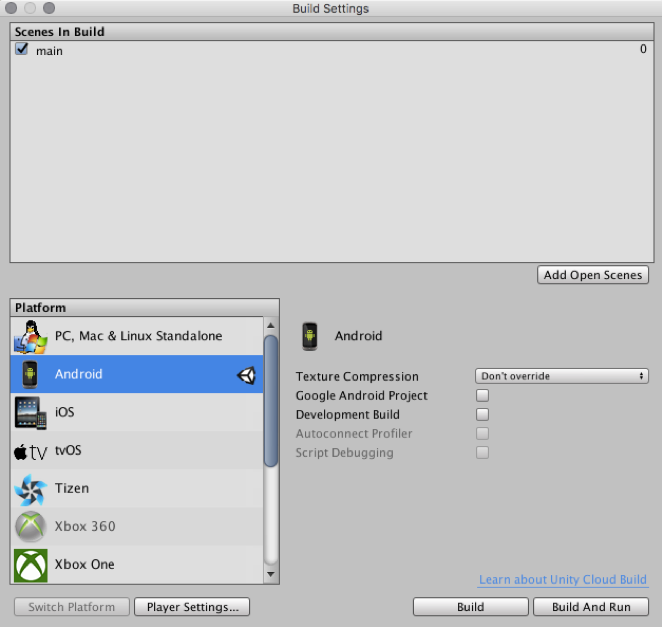

- Ajustar preferencias (Player Settings)
    - En el inspector > "Other Settings"
        - En Identification rellenamos los campos y marcamos como minimun API level Android 4.4 (que es la mínima para carbdoard).
    - En el inspector > "XR Settings"
        - Marcamos "virtual reality supported"
        - En Virtual Reality SDK seleccionamos Cardboard

- Ejecutamos la escena para comprobar que todo se ha configurado correctamente.
    - Simulamos el movimiento de cabeza (con ALT pulsado), la rotación (CTRL).
    - Simulamos que miramos al objeto interactivo para comprobar los eventos de activación al entrar el puntero en el objeto y desactivación al salir el puntero.
    - Simulamos la interacción con click, haciendo click con el ratón mientras el objeto está señalado.

- Compilamos Build, creando una carpeta en el proyecto para las builds y dándole un nombre a la apk.
    - Si la compilación no se realiza correctamente, repasar que en Preferences > External Tools estén los path del SDK y JDK de nuestro sistema. Si tenemos instalado Android Studio podemos consultarlos en File > Project Structure > SDK Location.

Aplicaciones Cardboard desde Unity 
======================================

Realizaremos un proyecto en Unity donde implementaremos los elementos específicos de una aplicación para Cardboard: cámara con respuesta al giroscopio, interacción con elementos de UI y objetos del entorno, uso del trigger, activación por tiempo, etc. Una vez implementados y probados en el editor, los desplegaremos en el dispositivo Android.

Conocidos estos elementos básicos, los utilizaremos para realizar (individualmente o en grupos) una aplicación o juego sencillo que los utilice. Para ello podremos añadir las funcionalidades que cada proyecto estime oportunas, por ejemplo puntuaciones, efectos de partículas, modelos 3d, animaciones, shakes de cámara, generación aleatoria de enemigos, etc. Se ofrecerá apoyo para la realización de las necesidades de cada proyecto específico.

Configuración del proyecto
--------------------------------
Comenzaremos abriendo Unity y creando un nuevo proyecto, con las librerías necesarias y preparado para compilar correctamente para la plataforma de destino, Android con Cardboard. 

Cámara VR
-------------------
Cámara que nos realiza la vista estereoscópica y responde al giroscopio para determinar el posicionamiento e inclinación de la cabeza.

- Añadimos un GameObject vacío para agrupar dentro los componentes VR necesarios. Añadimos los 3 prefabs que aparecen en la captura. 

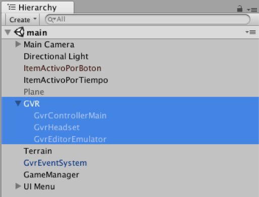

- Introduciremos varios elementos. Un plano con posición (0,-0,5,0) y un cubo (1,1,8).

- Al ejecutar el proyecto deberíamos poder manejar la posición de la cabeza pulsando Alt y la inclinación con Control.

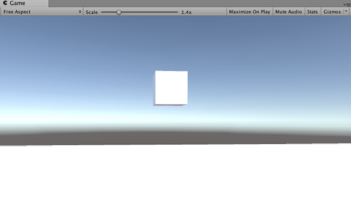

- Borramos el plano y hacemos un terreno más elaborado. Lo posicionamos (-200, -2, -200). Importamos el paquete environment (sólo carpeta environment). Usamos el editor de terrenos. Creamos el relieve del terreno. Pintamos con texturas (Paint, edit texture, add). Añadimos árboles, etc.

- Probamos en el dispositivo.

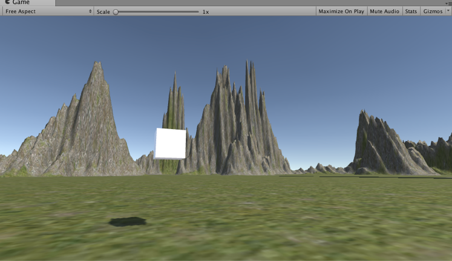

Gaze Tracking. Interacción con UI
------------------------------------------

El Gaze Tracking nos permite interactuar con los elementos que miramos. En este apartado crearemos una UI con varios botones, que se activarán cuando los miremos y pulsemos el botón del dispositivo (trigger).

- Añadimos un puntero que indica hacia donde miramos, GvrReticlePointer (prefab). Lo asociamos como hijo de la cámara principal para que se mueva junto con ella y ajustamos su posición a (0,0,0).

- Añadimos un sistema de eventos GvrEventSystem.

- Añadimos un Canvas
    - En él añadimos varios elementos anidados: un Panel con varios Botones.
    - Configuramos el Canvas estableciendo el render mode a World Space y ajustando su posición, tamaño y escala. Tocando estos elementos podemos ajustar la UI para que por ejemplo aparezca siempre a nuestros pies. Para UI con datos informativos podemos situarlas en cierta posición de la pantalla y hacer que nos siga con la mirada (asociándola a la cámara principal, al igual que hicimos con el puntero).
    - La última versión del SDK requiere que reemplazamos el componente "GraphicRaycaster" por "GvrPointerGraphicRaycaster" y "PhysicRaycaster" por "GvrPointerPhysicRaycaster. El canvas posee un componente "GraphicRaycaster", así que debemos añadir el del SDK, y el antiguo eliminarlo o desactivarlo. El "PhysicRaycaster" lo utilizaremos luego asociándolo a la cámara e igualmente deberemos usar el del SDK.

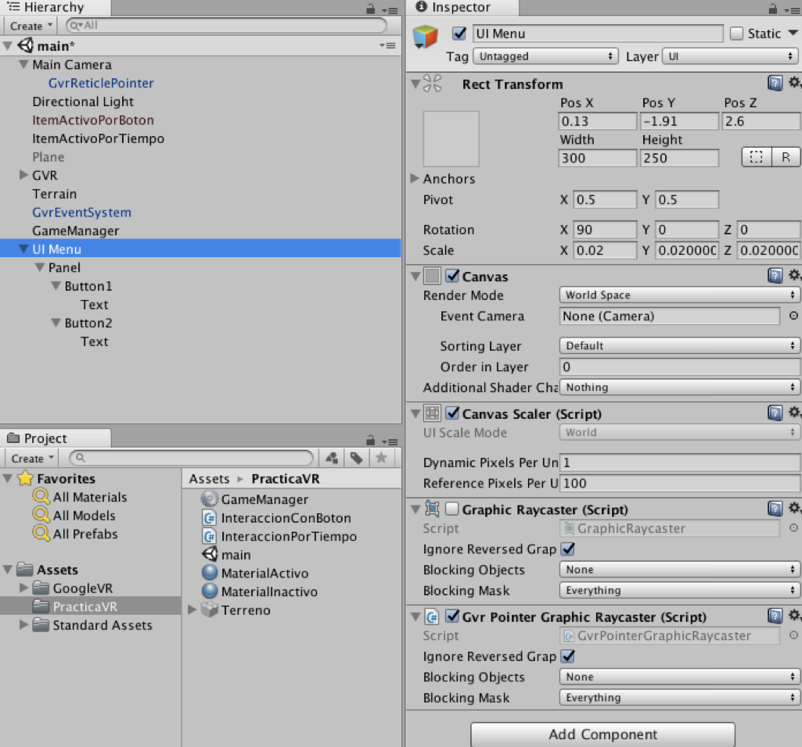

- Por último estableceremos una respuesta a sus eventos On Click. Vamos a implementar botones para reiniciar la escena y salir de la aplicación. Dicha funcionalidad la implementaremos en un nuevo script GameManager.cs que asociaremos a un nuevo game object Game Manager. 

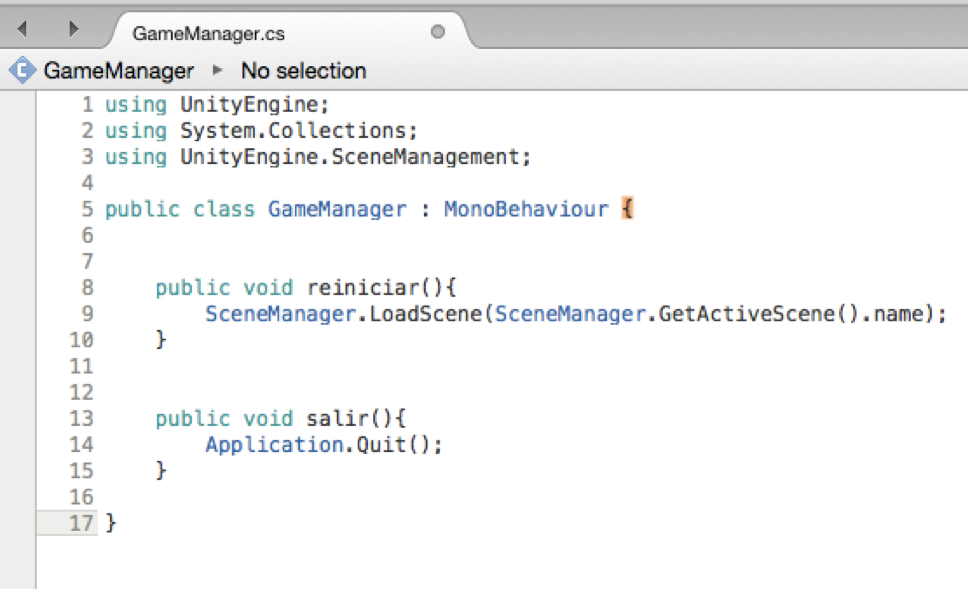

- En la configuración de cada botón asociamos la respuesta al evento On Click arrastrando el objeto Game Manager que contiene el script GameManager.cs y seleccionando en el desplegable el script GameManager.cs y la función que queremos lanzar (reiniciar, salir, etc.).
    - Podemos configurar para los botones un color de resalte y añadir un texto a cada botón, como "Reiniciar" y "Salir".

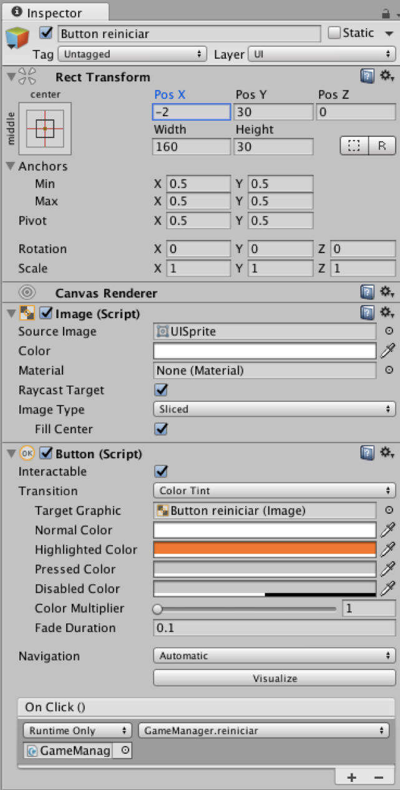

Gaze Tracking. Interacción con objetos
------------------------------------------
En este apartado incluiremos en la escena un objeto con el que interactuar. Al mirarlo cambiaremos su color, cuando dejemos de mirarlo volverá a su color original, y cuando pulsemos el botón trigger mientras lo miramos, haremos que cambie a otro lugar aleatorio. 

- Añadimos un raycaster a la cámara principal, asociándole el script GvrPointerPhysicsRaycaster (script). De este modo, la cámara lanzará rayos hacia delante (hacia el puntero) y podremos detectar si hay colisiones con objetos de la escena, para actuar en consecuencia (cambiándolos de color, destruyéndolos, activándolos, etc.).

- Creamos el objeto que queremos que reaccione. 
    - Comprobamos que tenga asociado un componente collider, en este caso un box collider, ya que si no es así no detectará la colisión con el rayo de la cámara.

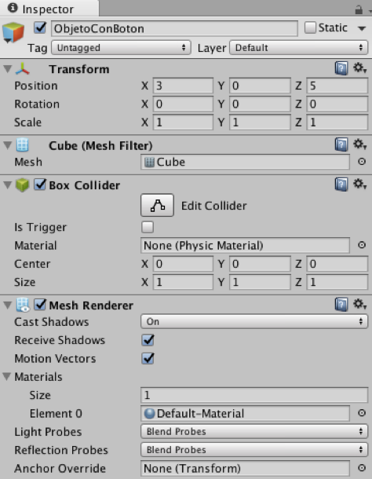

- Creamos varios materiales para usarlos en la interacción. Uno para el estado inactivo y otro para indicar que estamos señalando (mirando) el objeto.

- Creamos un nuevo script "InteraccionConBoton.cs" donde definiremos las funciones que queremos que se ejecuten como respuesta de los eventos:
    - Pointer Enter: mirar el objeto.
    - Pointer Click: pulsar el trigger mientras lo miramos.
    - Pointer Exit: dejar de mirarlo.

En este caso, definiremos una función "activa", que recibirá un bool como parámetro. Al mirar el objeto llamaremos a la función con true y se encargará de cambiar el material del objeto de inactivo a activo, y al dejar de mirarlo la llamaremos con false para que aplique el material inactivo.

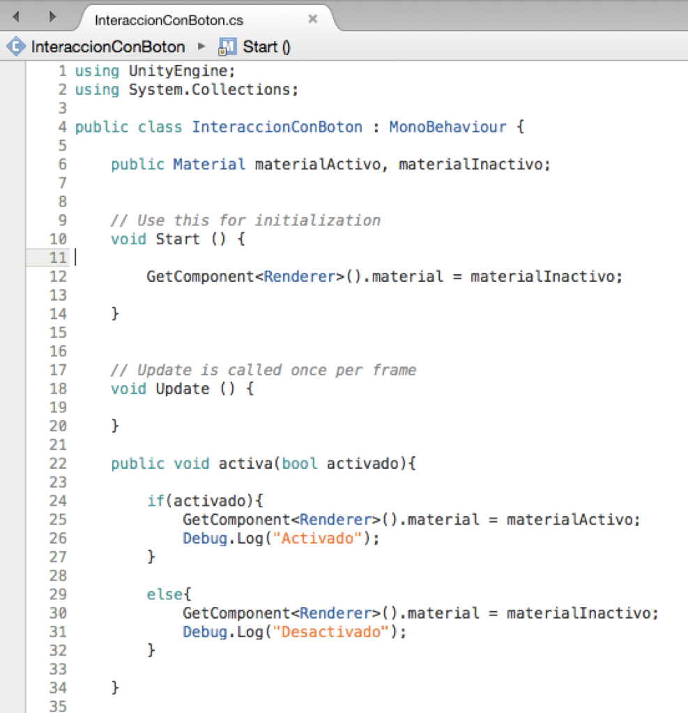

Añadimos otra función llamada interacción, que llamaremos al pulsar el trigger mientras miramos el objeto. Esta función cambiará la posición actual del objeto por otra posición aleatoria dentro de una distancia cercana a nuestro campo de visión.

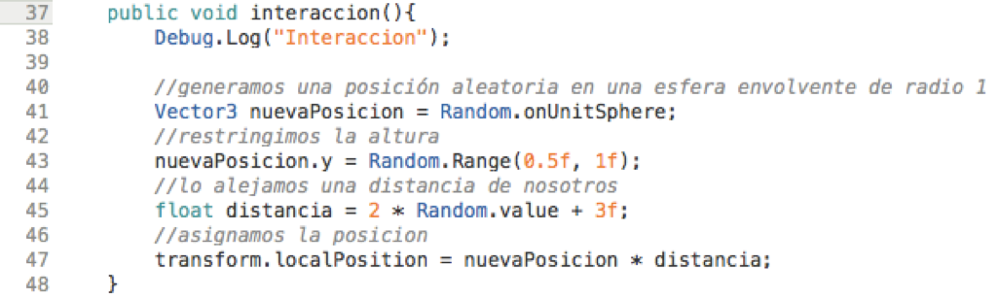

- Añadimos el script al objeto y asociamos los materiales.

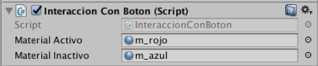

- Añadimos un componente para la gestión de los eventos, event trigger (componente). En él incluiremos los eventos que queremos manejar y para cada uno, la respuesta, que la indicaremos arrastrando el objeto que tiene asociado el script (el cubo anterior) y seleccionando en el menú desplegable el script "InteraccionConBoton.cs" y la función concreta que queremos lanzar.

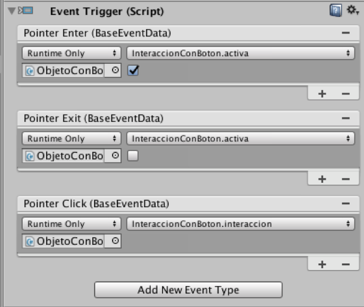

Gaze Tracking. Interacción por tiempo
--------------------------------------------
Añadiremos otro objeto similar, pero que en vez de activarse al pulsar el trigger, se activará al estar mirándolo x segundos.

- Para ello seguiremos el mismo procedimiento, pero crearemos una esfera para diferenciarlo del anterior, la posicionaremos, crearemos nuevos materiales si es necesario, etc.

- Crearemos y le asociaremos un nuevo script llamado "InteraccionPorTiempo.cs", en el que se ha definido una variable pública con un límite de tiempo (2 segundos) que puede ser configurada desde el inspector. Al comenzar (start) asignamos un contador de tiempo como infinito y lo modificaremos según estemos mirando o no el objeto. Al mirarlo lo iniciamos y al salir lo volvemos a poner a infinito. En la función update iremos comprobando si el contador ha alcanzado el tiempo de espera que habíamos definido (2 segundos) y en ese caso, lanzaremos la función de interacción. 

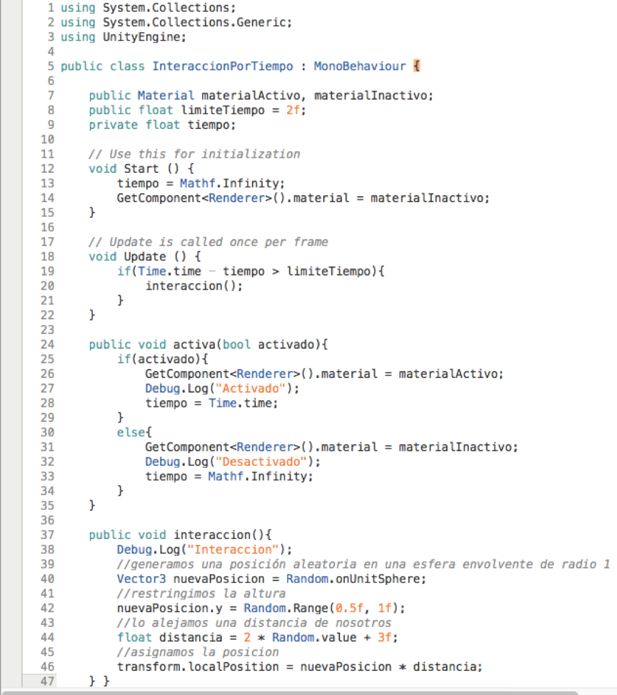

- Finalmente añadimos el componente para la gestión de los eventos, event trigger (componente) y definimos las respuestas a los eventos Pointer Enter y Pointer Exit en base al script creado, llamando a la función activa con true o false.

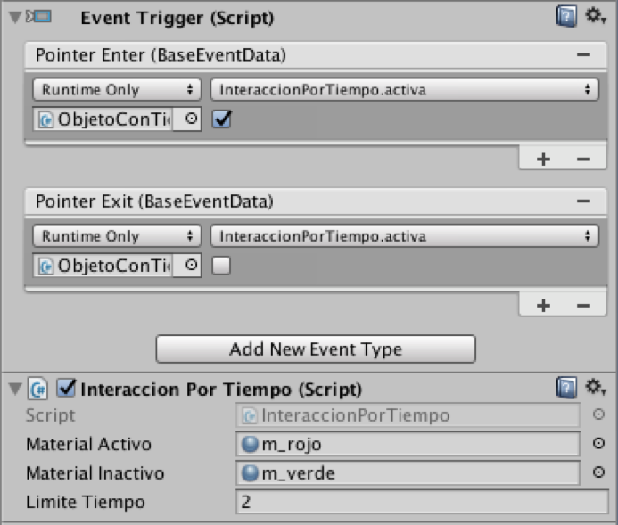

Sonido holofónico
-----------------------------

La técnica de sonido holofónico o también llamado 8D es capaz de emular de forma realista la posición una fuente de sonido utilizando únicamente sonido stereo. Por ejemplo, al sentir un sonido a nuestra derecha, nuestro oido derecho lo percibe casi completamente pero el izquierdo recibe una señal atenuada por nuestra cabeza. Esta técnica realiza estos cálculos para proporcionar a cada oido la señal ya modificada tal y como se realizaría con un sonido real en dicha posición.

Podemos aplicar esta técnica de forma fácil en nuestro proyecto. Los elementos que utilizamos pueden emitir un sonido con estas características y el jugador puede jugar con unos auriculares, de forma que al teletrasportarse los objetos a otra posición pueda también detectar por el sonido dónde se encuentra.

Para aplicarlo debermos importar en nuestro proyecto el paquete Google resonance audio para Unity.
`<https://developers.google.com/resonance-audio/develop/unity/getting-started>`_

Habrá que configurar el proyecto para que utilice este nuevo sistema de sonido en Edit > Project Settings > Audio, seleccionando "Resonance Audio" en los campos Spatializer Plugin y Ambisonic Decoder Plugin.

Una vez realizada esta configuración podemos comprobar su funcionamiento en la escena de demostración "ResonanceAudioDemo", y añadirlo a nuestro proyecto incorporando al objeto que queramos una fuente de sonido y el script "Resonance Audio Source". 

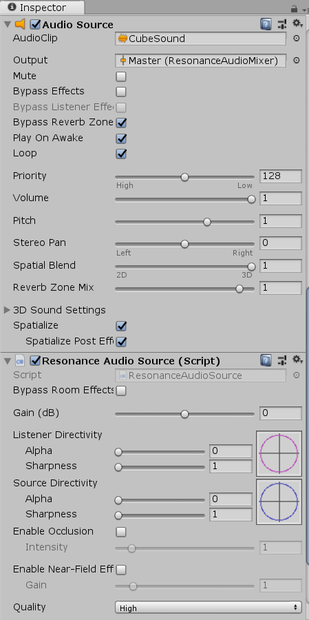