==========================
Niveles basados en tiles
==========================

En este tutorial veremos cómo diseñar un nivel basado en tiles para un juego 2D. Una buena opción es utilizar el editor `Tiled Map Editor <http://www.mapeditor.org/>`_ y cargar los niveles en Unity mediante scripts propios o desarrollados por terceros.

Tiled
=========

`Tiled Map Editor <http://www.mapeditor.org/>`_ es gratuito y multiplataforma. Permite diseñar de forma visual un nivel configurando sus dimensiones (número de casillas y tamaño) y utilizando una paleta de recursos, que pueden ir estampándose en capas. Los niveles pueden ser exportados en un formato propio tmx o csv, json, js, lua.

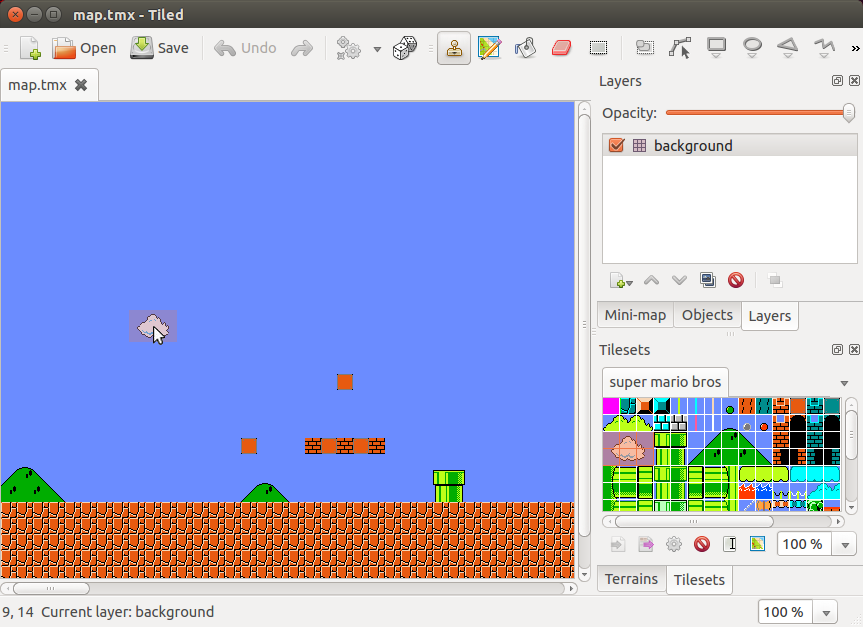

Usando Tiled
==============

En primer lugar creamos un nuevo mapa y establecemos su configuración de formato y tamaño de mapa y tiles.

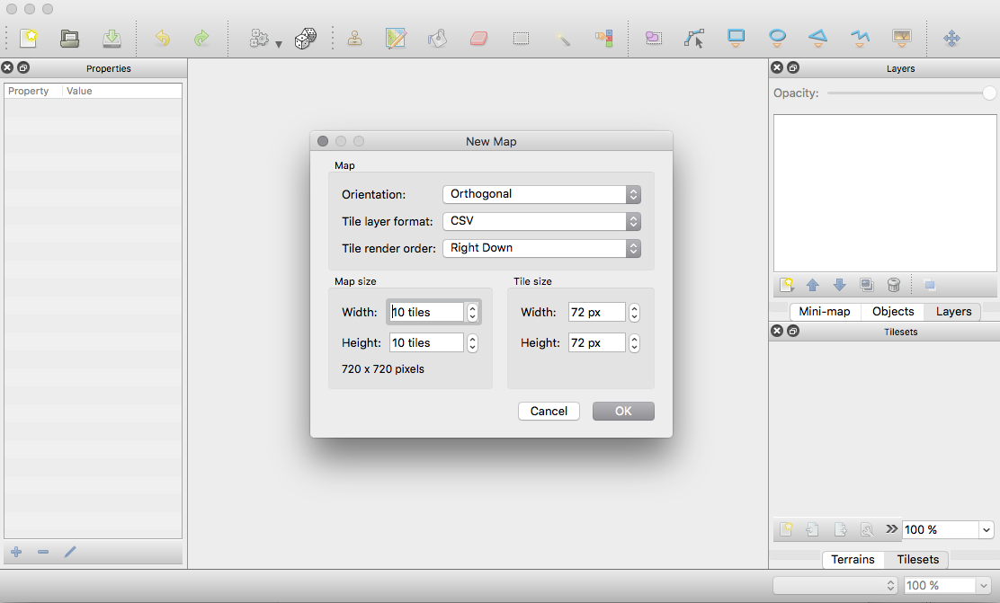

A continuación creamos una paleta con los recursos gráficos que utilizaremos para diseñar el nivel. Utilizaremos una imagen de plantilla en la que tenemos los elementos más comunes.

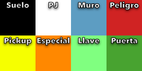

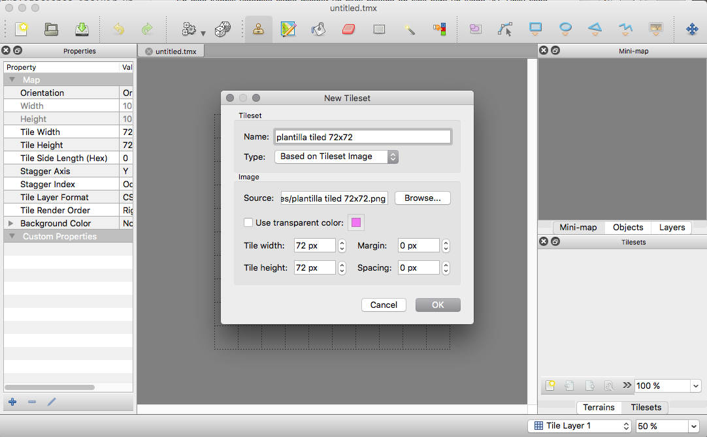

Con estos elementos procedemos a diseñar el nivel.

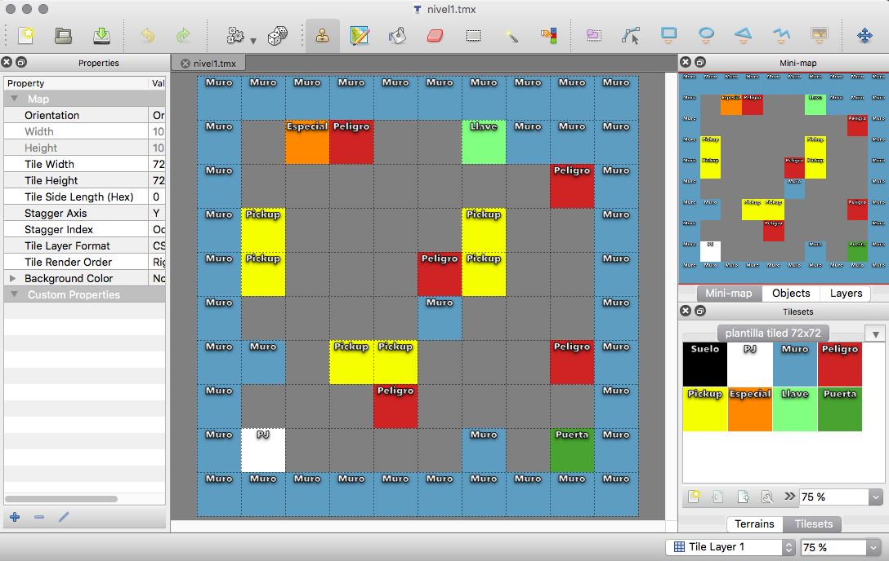

Una vez terminado, lo exportamos con formato CSV.

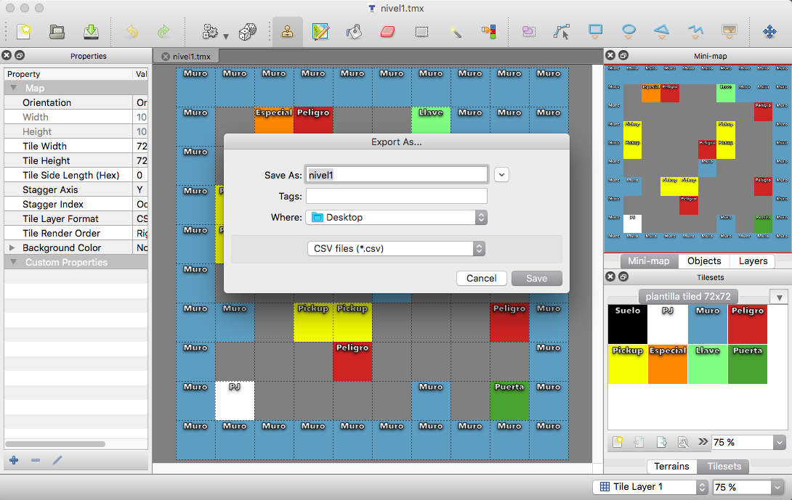

Si abrimos el fichero podemos ver cómo tenemos representadas cada casilla utilizando un número que corresponde con el elemento de la paleta que pintamos o -1 para casillas vacías.

.. code-block:: java

    2,2,2,2,2,2,2,2,2,2
    2,-1,5,3,-1,-1,6,2,2,2
    2,-1,-1,-1,-1,-1,-1,-1,3,2
    2,4,-1,-1,-1,-1,4,-1,-1,2
    2,4,-1,-1,-1,3,4,-1,-1,2
    2,-1,-1,-1,-1,2,-1,-1,-1,2
    2,2,-1,4,4,-1,-1,-1,3,2
    2,-1,-1,-1,3,-1,-1,-1,-1,2
    2,1,-1,-1,-1,-1,2,-1,7,2
    2,2,2,2,2,2,2,2,2

Paso a Unity
================

Una vez realizados los mapas, los pasaremos a Unity implementando el código necesario. También existen herramientas en github, unity store, etc. que nos ayudan en el proceso, soportan más o menos funciones y fallan más o menos. [Tiled2Unity](http://www.seanba.com/tiled2unity) parece ser de las más interesantes.

Para nuestro ejemplo, en primer lugar, creamos un proyecto 2D y creamos los assets necesarios. Cargamos la imagen de la plantilla (pixels per unit = 72 y modo múltiple), con el editor de sprites sacamos sus 8 sprites de 72x72 y los renombramos.

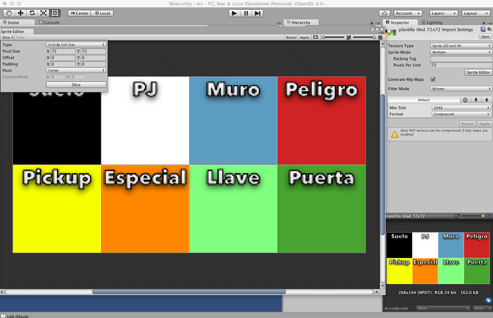

Por cada tipo de tile, creamos un prefab al que le añadiremos el sprite correspondiente.

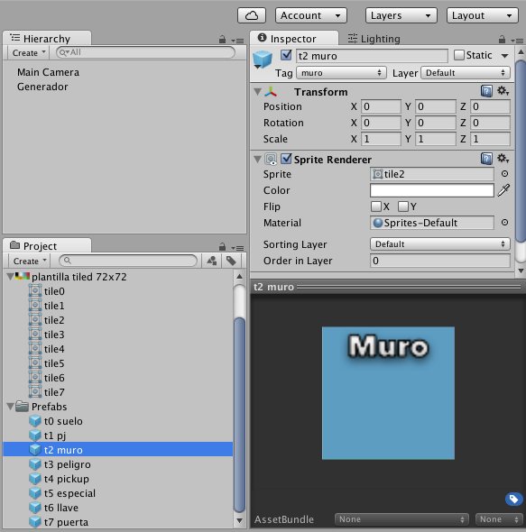

Implementación
================

Creamos un script "GeneradorNiveles" que asociaremos a un GameObject vacío. En este script establecemos como atributos públicos a mostrar en la interfaz aquellos que nos sirven para su configuración: ficheros csv con los niveles, dimensiones y prefab asociado a cada tipo de tile.

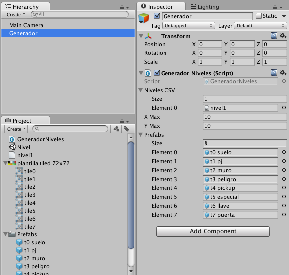

Las lecturas y escrituras en ficheros consumen muchos más recursos que el manejo de estructuras de datos en memoria. Si se desea realizar un juego en el que necesitamos controlar las casillas en tiempo de ejecución (como un puzzle donde intercambiar casillas, ver a dónde podemos mover, etc.), sería conveniente leer el fichero csv y cargarlo en una estructura interna. En este caso usaremos una matriz bidimensional.

.. code-block:: c#

    private int[][] nivel = new int[][]{
        new int[]{-1,-1,-1,-1,-1,-1,-1,-1,-1,-1,-1,-1,-1,-1,-1,-1,-1,-1,-1,-1},
        new int[]{-1,-1,-1,-1,-1,-1,-1,-1,-1,-1,-1,-1,-1,-1,-1,-1,-1,-1,-1,-1},
        new int[]{-1,-1,-1,-1,-1,-1,-1,-1,-1,-1,-1,-1,-1,-1,-1,-1,-1,-1,-1,-1},
        new int[]{-1,-1,-1,-1,-1,-1,-1,-1,-1,-1,-1,-1,-1,-1,-1,-1,-1,-1,-1,-1},
        new int[]{-1,-1,-1,-1,-1,-1,-1,-1,-1,-1,-1,-1,-1,-1,-1,-1,-1,-1,-1,-1},
        new int[]{-1,-1,-1,-1,-1,-1,-1,-1,-1,-1,-1,-1,-1,-1,-1,-1,-1,-1,-1,-1},
        new int[]{-1,-1,-1,-1,-1,-1,-1,-1,-1,-1,-1,-1,-1,-1,-1,-1,-1,-1,-1,-1},
        new int[]{-1,-1,-1,-1,-1,-1,-1,-1,-1,-1,-1,-1,-1,-1,-1,-1,-1,-1,-1,-1},
        new int[]{-1,-1,-1,-1,-1,-1,-1,-1,-1,-1,-1,-1,-1,-1,-1,-1,-1,-1,-1,-1},
        new int[]{-1,-1,-1,-1,-1,-1,-1,-1,-1,-1,-1,-1,-1,-1,-1,-1,-1,-1,-1,-1}
    };

Para cargar el nivel desde el fichero CSV, simplemente lo recorremos línea a línea y campo a campo, y copiamos el valor del elemento a la casilla correspondiente de la matriz.

.. code-block:: c#

    public void cargarCSV(TextAsset fichero) {

        char separadorLinea = '\n';
        char separadorCampo = ',';

        // Proceso el fichero. Traigo todas las lineas
        string[] lineas = fichero.text.Split (separadorLinea);
        string[] campos;

        // Las recorro campo a campo
        for(int fila = 0; fila < lineas.Length-1; fila++){

            campos = lineas[fila].Split(separadorCampo);
            for(int col = 0; col < campos.Length; col++){
                nivel[fila][col] = int.Parse (campos[col]);
            }
        }
    }

Con esta información podemos dibujar desde la matriz todos los elementos, instanciando los prefabs correspondientes. Para que el nivel quede representado como en tiled y en la matríz, hay que voltearlo simétricamente, pintando el elemento (x,y) en (y, maximo-x). Para una mejor organización, todos los elementos generados se crean como hijos de un GameObject llamado "Nivel".

Si queremos añadir más variedad de elementos sin tener que hacerlo en tiled creando una paleta mayor, podemos extender este código fácilmente. Para cada tipo de tile, podemos asociar un array de prefabs de modo que al instanciarlo se elija uno aleatoriamente. Así podemos tener fácilmente varios tipos de enemigos, peligros, etc.

.. code-block:: c#

    public void dibujarNivel(){

        // por organizacion, todos los objetos generados los metere anidados en un padre
        GameObject padre = new GameObject("Nivel");

        // recorro la informacion del nivel y voy creando los objetos
        for(int x=0; x<nivel.Length; x++){
            for(int y=0; y<nivel[x].Length; y++){

                int n = nivel[x][y];

                // si es -1 no pinto nada y sino, su prefab correspondiente
                if(n >= 0 && n < prefabs.Length){
                    GameObject nuevo = (GameObject) Instantiate(prefabs[n], new Vector2(y, nivel.Length - x), Quaternion.identity);
                    nuevo.transform.parent = padre.transform;
                }
            }
        }
    }   

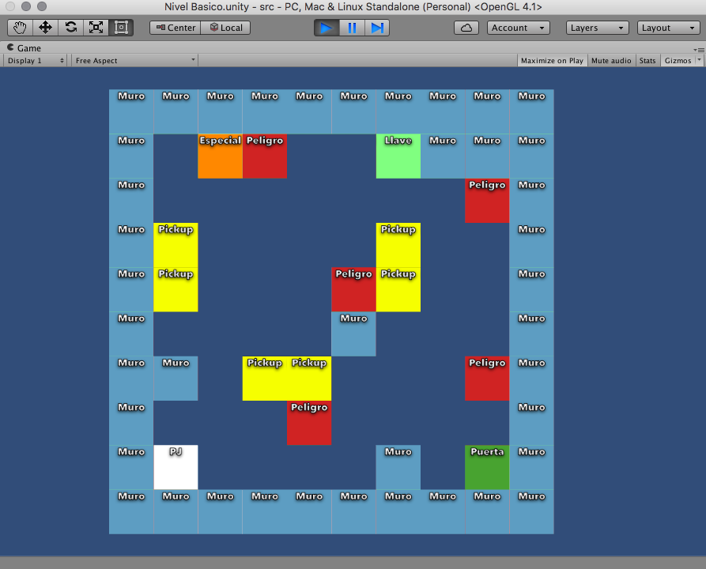

Adicionalmente, podemos crear métodos que permitan cargar un nivel csv de una lista de posibles niveles, ya sea secuencialmente o aleatoriamente.

.. code-block:: c#

    public void generarSiguienteNivel(){

        // genera un nivel nuevo distinto al actual
        int numeroDeNivel;
        do{
            numeroDeNivel = Random.Range(0, nivelesCSV.Length);
        }while(numeroDeNivel == nivelActual);

        borrarNivel();
        cargarCSV(nivelesCSV[numeroDeNivel]);
        dibujarNivel();
        nivelActual = numeroDeNivel;
    }

    public void borrarNivel(){
        // reseteo la matriz
        for(int i=0; i < xMax; i++)
            for(int j=0; j< yMax; j++)
                nivel[i][j]=-1;

        // elimino los gameobjects de la jerarquia
        GameObject go = GameObject.Find("Nivel");
        if(go != null){
            Destroy(go);
        }
    }

Toques finales
===============

Modificamos los prefabs a su estado final, en el que se utilizarán otros sprites, añadiremos colliders, rigidbody, scripts, etc.

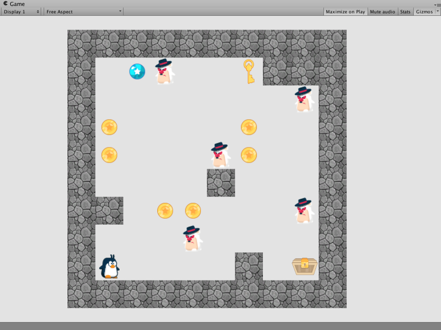

Enlaces
============

- `Tiled Map Editor <http://www.mapeditor.org/>`_
- En Github, varios proyectos para integrarlo con Unity (como `Tiled2Unity <http://www.seanba.com/tiled2unity>`_)