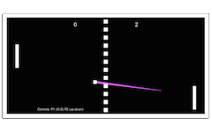

=================
Pong
=================

Pong es un juego de tenis de mesa muy simple, que es muy utilizado como ejemplo para desarrollar un primer videojuego. Es como el equivalente al "hola mundo" de la programación.  
Fue el primer juego desarrollado por Atari, en 1972, y aunque no es el primer juego de la historia, sí que fue el primero en comercializarse y tener mayor repercusión.  
Para hacer este juego he seguido el tutorial enlazado arriba. En él se comentan los elementos básicos de Unity y crea un script para el movimiento de la pala y otro para la bola.

Pala 
=================

El script de la pala se encarga de recoger las entradas del jugador con **Input.GetKey()** y mover la pala arriba o abajo con **transform.Translate()**. Para el GetKey utilizaremos dos variables públicas que luego asignaremos desde la interfaz, así asignaremos las teclas que queramos para cada pala, por ejemplo W,S para una y las flechas para la otra.

.. code-block:: c#

	public KeyCode up, down;
	public float velocidad = 0.1f;

	void FixedUpdate () {

	if (Input.GetKey(up))
	{
		transform.Translate (new Vector2(0, velocidad));
	}

	if (Input.GetKey(down))
	{
		transform.Translate (new Vector2(0, -velocidad));
	}
	}

Bola 
=================

El script de la bola inicia su movimiento con **rigidbody2D.velocity** y observa si colisiona con alguna pala para cambiar su dirección. Se utiliza una función auxiliar llamada **hitFactor** para saber en qué parte de la pala golpeó la bola (parte superior, central o inferior), y tenerlo en cuenta para lanzar la bola en esa dirección.

.. code-block:: c#

	void Start () {
		rigidbody2D.velocity = Vector2.one.normalized * velocidad;
	}

	void OnCollisionEnter2D(Collision2D col){
		if (col.gameObject.name == "RacketLeft")
		{
			float y = hitFactor(transform.position, 
								col.transform.position, 
								col.collider.bounds.size.y);
			Vector2 dir = new Vector2(1, y);
			rigidbody2D.velocity = dir * velocidad;
		}
		if (col.gameObject.name == "RacketRight")
		{
			float y = hitFactor(transform.position, 
								col.transform.position, 
								col.collider.bounds.size.y);
			Vector2 dir = new Vector2(-1, y);
			rigidbody2D.velocity = dir * velocidad;		
		}
	}

	/* devuelve la zona donde ha tocado en la pala: 
	* 1 arriba, 0 mitad, -1 abajo */
	float hitFactor(Vector2 ballPos, Vector2 racketPos, float racketHeight)
	{
		return (ballPos.y - racketPos.y) / racketHeight;
	}

Después de realizar este tutorial básico añadí algunas características extra que os comento.

Controlar cuando se mete un gol
==================================

Del mismo modo que se controla cuándo la bola golpea con una pala, controlamos si golpea con el límite izquierdo o derecho del campo de juego. El golpeo en un lado representa que el jugador del otro lado metió un gol.  
Cuando esto ocurre realizo varias acciones. Creo puntuaciones para cada jugador, que incremento con cada gol y hago un saque central en el que la bola va hacia el jugador que recibió el gol.

.. code-block:: c#

	// si choca con la pared izq, gol del jugador de la der
	if (col.gameObject.name == "WallLeft"){ 
		puntuacionDer++;
		textoDer.text = puntuacionDer.ToString();
		saqueCentral(-1);
	}

	// si choca con la pared der, gol del jugador de la izq
	if (col.gameObject.name == "WallRight"){ 
		puntuacionIzq++;
		textoIzq.text = textoIzq.ToString();
		saqueCentral(1);
	}
	
	/* Al meter un gol, hacemos un saque central hacia el que ha perdido. Lo indicamos con sentido -1 izquierda o 1 derecha */
	void saqueCentral(int sentido){
		transform.position = inicial;
		Vector2 dir = new Vector2(sentido, 0);
	}

Subir la dificultad a cada golpe
==================================

A cada golpe, incremento la velocidad de la bola y reduzco un poco el tamaño de las palas. De esta forma el juego se va complicando y es más fácil meter un gol. Lo único que hay que tener en cuenta es crear variables auxiliares que guarden la velocidad inicial de la bola y el tamaño inicial de las palas, para restaurarlas cuando vayamos a hacer el saque central.

.. code-block:: c#

	void saqueCentral(int sentido){
		transform.position = inicial;
		Vector2 dir = new Vector2(sentido, 0);

		// volvemos a poner la velocidad inicial
		velocidad = velocidadInicial;
		rigidbody2D.velocity = dir * velocidad;

		// volvemos a poner el tamaño original de las palas
		GameObject rl = GameObject.Find("RacketLeft");
		rl.SendMessage("reiniciarTamanoPala");
		GameObject rr = GameObject.Find("RacketRight");
		rr.SendMessage("reiniciarTamanoPala");
	}
