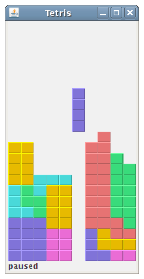
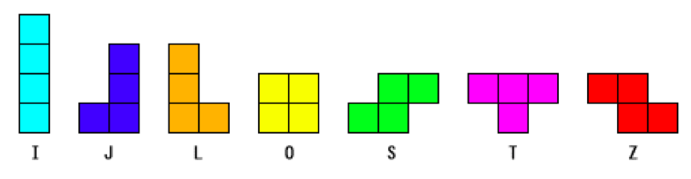

===================
Tetris (Java)
===================

Tetris es uno de los juegos de ordenador más populares jamás creados. El juego original fue diseñado y programado por un programador ruso, Alexey Pajitnov, en 1985. Desde entonces, Tetris está disponible en todas las plataformas y existen numerosas variaciones.

El juego consiste en un puzle en el que hay que ir colocando piezas que van cayendo. Las piezas se van generando en la parte superior de la pantalla y caen hacia abajo del tablero. El objetivo del juego es mover y rotar las piezas, para que se ajusten lo más posible. Si logramos formar una fila, la fila se destruye y la puntuación aumenta. Mientras que la condición de derrota se da cuando es imposible colocar una nueva pieza dado que la pantalla está llena de piezas.

Tenemos siete piezas diferentes llamados tetrominoes. Cada una de estas piezas está formada con cuatro cuadrados dispuestos de diferente forma. De este modo tenemos, en forma de I, J, L (J invertida), O, S, T, Z (S invertida). 

El software está implementado en 3 clases:

- Tetris, es la clase principal, que contiene el método main.
- Shape, es la encargada de la gestión de las piezas. En ella se definen los tipos de piezas, su composición, operaciones de rotación, etc.
- Board, es la encargada de gestionar el tablero y la lógica de juego. En ella se guarda el estado del tablero con la colocación de todas las piezas, se indica cuándo generar una pieza, cómo se realiza el efecto de caída, cuándo borrar una línea completa, etc.

Tetris 
===================

.. code-block:: java

	import java.awt.BorderLayout;
	import javax.swing.JFrame;
	import javax.swing.JLabel;

	public class Tetris extends JFrame {

	    JLabel statusbar;

	    public Tetris() {

	    // Creamos una barra de estado
	        statusbar = new JLabel(" 0");
	        add(statusbar, BorderLayout.SOUTH);
	        
	    // Cremos el tablero de juego
	        Board board = new Board(this);
	        add(board);
	        board.start(); // este metodo arranca el juego
	        setSize(200, 400);
	        setTitle("Tetris");
	        setDefaultCloseOperation(EXIT_ON_CLOSE);
	   }
	
	   public JLabel getStatusBar() {
	       return statusbar;
	   }
	
	    public static void main(String[] args) {
	
	        Tetris game = new Tetris();
	        game.setLocationRelativeTo(null);
	        game.setVisible(true);
	
	    } 
	}

Shape
===================

.. code-block:: java

	import java.util.Random;
	import java.lang.Math;

	public class Shape {

	/* Este enumerado mantiene los Tetrominoes, que son las 7 piezas posibles y una pieza en blanco llamada NoShape */
	enum Tetrominoes { NoShape, ZShape, SShape, LineShape, 
	               TShape, SquareShape, LShape, MirroredLShape };
	
	// Cada pieza tiene un tipo de este enumerado
	private Tetrominoes pieceShape;
	// y unas coordenadas para la forma de la pieza (de 4x2)
	private int coords[][];
	// CoordsTable almacena todas las coordenadas de los diferentes tipos de piezas
	private int[][][] coordsTable;

	/* El constructuor inicializa:
	- el array de coordenadas de la pieza a un array de 4x2
	- el tipo de pieza a NoShape */
	public Shape() {
		coords = new int[4][2];
		setShape(Tetrominoes.NoShape);	
	    }
	
	/* Este método recibe un tipo de pieza (shape) y asigna los valores de las coordenadas de la pieza (coords) segun el tipo de pieza que es. Para ello busca en (coordsTable), el tipo de pieza y la copia a coords. */
	    public void setShape(Tetrominoes shape) {
	
	/* Cada fila de coordsTable representa un tipo de pieza y estan en el orden en el que aparecen en el enumerado. Por ejemplo, los numeros { 0, -1 }, { 0, 0 }, { -1, 0 }, { -1, 1 }, representan la pieza S-shape rotada.*/ 
		coordsTable = new int[][][] {
		{ { 0, 0 },   { 0, 0 },   { 0, 0 },   { 0, 0 } },
		{ { 0, -1 },  { 0, 0 },   { -1, 0 },  { -1, 1 } },
		{ { 0, -1 },  { 0, 0 },   { 1, 0 },   { 1, 1 } },
		{ { 0, -1 },  { 0, 0 },   { 0, 1 },   { 0, 2 } },
		{ { -1, 0 },  { 0, 0 },   { 1, 0 },   { 0, 1 } },
		{ { 0, 0 },   { 1, 0 },   { 0, 1 },   { 1, 1 } },
		{ { -1, -1 }, { 0, -1 },  { 0, 0 },   { 0, 1 } },
		{ { 1, -1 },  { 0, -1 },  { 0, 0 },   { 0, 1 } }
	};
	
	/* Aqui es donde se copia la fila de la pieza que nos interesa de la coordsTable a las coordenadas de la pieza (coords). Para saber que fila de la tabla coger debemos saber que posicion ocupa esa pieza (shape) dentro del enumerado. Esto lo hacemos utilizando el metodo ordinal() que nos devuelve un entero con la posicion que ocupa. */
	for (int i = 0; i < 4 ; i++) {
		for (int j = 0; j < 2; ++j) {
			coords[i][j] = coordsTable[shape.ordinal()][i][j];
		}
	}
	        
	// Por ultimo asignamos el tipo de pieza actual
	pieceShape = shape;
	
	}
	
	/* Metodos Get y Set */ 
	private void setX(int index, int x) { coords[index][0] = x; }
	private void setY(int index, int y) { coords[index][1] = y; }
	public int x(int index) { return coords[index][0]; }
	public int y(int index) { return coords[index][1]; }
	public Tetrominoes getShape()  { return pieceShape; }

	/* Metodo que genera una figura aleatoriamente */ 
	public void setRandomShape()
	{
		Random r = new Random();
		int x = Math.abs(r.nextInt()) % 7 + 1;
		Tetrominoes[] values = Tetrominoes.values(); 
		setShape(values[x]);
	}

	/* Mira las coordenadas de la pieza y buscan la posicion minima en x e y */
	public int minX()
	{
		int m = coords[0][0];
		for (int i=0; i < 4; i++) {
			m = Math.min(m, coords[i][0]);
		}
		return m;
	}

	public int minY() 
	{
		int m = coords[0][1];
		for (int i=0; i < 4; i++) {
			m = Math.min(m, coords[i][1]);
		}
		return m;
	}

	/* Rota la pieza a la izquierda o derecha y devuelve la nueva forma.
		- Primero comprueba que la forma no sea el cuadrado, ya que si lo es, como no hay que rotarlo lo devuelve directamente.
		- En caso contrario crea una nueva forma (Shape) donde va guardando la forma rotada.
		- Para ello, recorre los 4 elementos de la forma, del tipo {int, int} y va asignandole los nuevos valores.
		- Utiliza los metodos get y(int index) x(int index) y los metodos set setX(int index, int x) y setY(int index, int y) */
	public Shape rotateLeft() 
	{
		if (pieceShape == Tetrominoes.SquareShape)
			return this;

		Shape result = new Shape();
		result.pieceShape = pieceShape;

		for (int i = 0; i < 4; ++i) {
			result.setX(i, y(i));
			result.setY(i, -x(i));
		}
		return result;
	}

	public Shape rotateRight()
	{
		if (pieceShape == Tetrominoes.SquareShape)
			return this;

		Shape result = new Shape();
		result.pieceShape = pieceShape;

		for (int i = 0; i < 4; ++i) {
			result.setX(i, -y(i));
			result.setY(i, x(i));
		}
		return result;
	}
	}

Board
===================

.. code-block:: java

	import java.awt.Color;
	import java.awt.Dimension;
	import java.awt.Graphics;
	import java.awt.event.ActionEvent;
	import java.awt.event.ActionListener;
	import java.awt.event.KeyAdapter;
	import java.awt.event.KeyEvent;
	import javax.swing.JLabel;
	import javax.swing.JPanel;
	import javax.swing.Timer;
		
	public class Board extends JPanel implements ActionListener {

	    // Inicializamos algunas variables importantes

	    // El tablero contiene un conjunto de formas
	    Shape.Tetrominoes[] board;     
	    // Tamano del tablero
	    final int BoardWidth = 10;
	    final int BoardHeight = 22;
	    
	    // numLinesRemoved mantiene el contador de las lineas que hemos limpiado
	    int numLinesRemoved = 0;
	    JLabel statusbar;
	    
	    // pieza actual
	    Shape curPiece;
	    // curX y curY determinan la posicion actual de la pieza que esta cayendo
	    int curX = 0;
	    int curY = 0;
	   
	    // isFallingFinished determina si la pieza ha terminado de caer
	    // para asi saber si tenemos que generar una nueva
	    boolean isFallingFinished = false;
	    boolean isStarted = false;
	    boolean isPaused = false;
	    Timer timer;

	    /* Constructor */
	    public Board(Tetris parent) {
	
	       // Llamamos explicitamente al metodo setFocusable() con true
	       // para que desde ahora tenga el foco y el imput del teclado 
	       setFocusable(true);
	
	       // Generamos una nueva pieza
	       curPiece = new Shape();
	       
	       // El timer lanza eventos cada cierto tiempo indicado por el delay.
	       // En nuestro caso el timer llama a actionPerformed() cada 400 ms
	       timer = new Timer(400, this);
	       timer.start(); 
	
	       // Asignamos la barra de estado
	       statusbar =  parent.getStatusBar();
	       
	       // Iniciamos el tablero con piezas vacias hasta el ancho y alto indicados
	       board = new Shape.Tetrominoes[BoardWidth * BoardHeight];
	       
	       addKeyListener(new TAdapter());
	       clearBoard();  
	    }
	
	    /* El metodo actionPerformed() comprueba si la caida de la pieza ha finalizado. En ese caso genera una nueva pieza con newPieze(). En caso contrario mueve una linea abajo con oneLineDown() */
	    public void actionPerformed(ActionEvent e) {
	        if (isFallingFinished) {
	            isFallingFinished = false;
	            newPiece();
	        } else {
	            oneLineDown();
	        }
	    }
	
	    // Metodos auxiliares
	    int squareWidth() { return (int) getSize().getWidth() / BoardWidth; }
	    int squareHeight() { return (int) getSize().getHeight() / BoardHeight; }
	    Shape.Tetrominoes shapeAt(int x, int y) { return board[(y * BoardWidth) + x]; }

	    // Inicializa una partida nueva
	    public void start()
	    {
	        if (isPaused)
	            return;
	
	        isStarted = true;
	        isFallingFinished = false;
	        numLinesRemoved = 0;
	        clearBoard();
	
	        newPiece();
	        timer.start();
	    }
	
	    // Pausa o despausa la partida
	    private void pause()
	    {
	        if (!isStarted)
	            return;
	
	        isPaused = !isPaused;
	        if (isPaused) {
	            timer.stop();
	            statusbar.setText("paused");
	        } else {
	            timer.start();
	            statusbar.setText(String.valueOf(numLinesRemoved));
	        }
	        repaint();
	    }
	
	    /* Este metodo dibuja todos los objetos en el tablero.
	     * El proceso tiene 2 pasos:
	     * 1. Se pintan todas las figuras que ya se habian colocado en el tablero.
	     * 2. Pintamos la figura que esta cayendo actualmente. */
	    public void paint(Graphics g)
	    { 
	        super.paint(g);
	
	        Dimension size = getSize();
	        int boardTop = (int) size.getHeight() - BoardHeight * squareHeight();
	
	        /* 1. Se pintan todas las figuras que ya han tocado la parte baja del tablero. Todos los cuadrados estan guardados en el array de tablero y podemos acceder a el usando el metodo shapeAt() */
	        for (int i = 0; i < BoardHeight; ++i) {
	            for (int j = 0; j < BoardWidth; ++j) {
	                Shape.Tetrominoes shape = shapeAt(j, BoardHeight - i - 1);
	                if (shape != Shape.Tetrominoes.NoShape)
	                    drawSquare(g, 0 + j * squareWidth(),
	                               boardTop + i * squareHeight(), shape);
	            }
	        }
	
	        /* 2. Pintamos la figura que esta cayendo actualmente. */
	        if (curPiece.getShape() != Shape.Tetrominoes.NoShape) {
	            for (int i = 0; i < 4; ++i) {
	                int x = curX + curPiece.x(i);
	                int y = curY - curPiece.y(i);
	                drawSquare(g, 0 + x * squareWidth(),
	                           boardTop + (BoardHeight - y - 1) * squareHeight(),
	                           curPiece.getShape());
	            }
	        }
	    }
	
	    /* Metodo que hace caer la pieza actual de forma rapida si pulsamos la tecla espacio. El proceso que realiza consiste en bajar la pieza una linea hasta que ya no pueda bajar mas, sea porque haya llegado al final del tablero o porque haya chocado con otra pieza.
        Para implementar el metodo se utilizan dos metodos auxiliares:
	    - tryMove para saber si se puede mover la pieza a ese nuevo lugar
	    - y pieceDropped que una vez que la pieza tiene ya su posicion definitiva la guarda en el array del tablero */
	    private void dropDown()
	    {
	        int newY = curY;
	        while (newY > 0) {
	            if (!tryMove(curPiece, curX, newY - 1))
	                break;
	            --newY;
	        }
	        pieceDropped();
	    }
	
	    /* Este metodo mueve la pieza una linea abajo si es posible.
	     Para implementar el metodo se utilizan dos metodos auxiliares:
	     - tryMove para saber si se puede mover la pieza a ese nuevo lugar
	     - y pieceDropped que una vez que la pieza tiene ya su posicion definitiva la guarda en el array del tablero */
	    private void oneLineDown()
	    {
	        if (!tryMove(curPiece, curX, curY - 1))
	            pieceDropped();
	    }

	    /* Este metodo limpia el array del tablero (board). Para ello, asigna a cada una de sus casillas una figura vacia (Tetrominoes NoShape). */
	    private void clearBoard()
	    {
	        for (int i = 0; i < BoardHeight * BoardWidth; ++i)
	            board[i] = Shape.Tetrominoes.NoShape;
	    }
	
	    /* Este metodo anade la pieza que esta cayendo al array del tablero (board). Se llamara cuando la pieza ya haya terminado de caer, asi que debemos comprobar si ha hecho una linea que hay que borrar o no, llamando para ello al metodo removeFullLines(). Por ultimo, intentamos crear una nueva pieza para seguir jugando. */
	    private void pieceDropped()
	    {
	        for (int i = 0; i < 4; ++i) {
	            int x = curX + curPiece.x(i);
	            int y = curY - curPiece.y(i);
	            board[(y * BoardWidth) + x] = curPiece.getShape();
	        }
	
	        removeFullLines();
	
	        if (!isFallingFinished)
	            newPiece();
	    }
	
	    /* Este metodo crea una nueva pieza que cae y la asigna a curPiece. Lo asigna con una forma aleatoria usando el metodo setRandomShape. Entonces inicializamos su posicion actual curX y curY a la parte superior. Posteriormente vemos si la pieza se puede mover a esa posicion inicial que hemos asignado, utilizando el metodo tryMove.
	     Si no se puede mover es porque ya esta todo el tablero lleno y hemos perdido y por lo tanto, debemos hacer varias cosas:
	     - asignar a la p ieza actual curPiece la figura NoShape
	     - parar el timer
	     - cambiar el booleano de comienzo isStarted a falso
	     - asignar a la barra de estado statusbar el texto "game over" */
	    private void newPiece()
	    {
	        curPiece.setRandomShape();
	        curX = BoardWidth / 2 + 1;
	        curY = BoardHeight - 1 + curPiece.minY();
	
	        if (!tryMove(curPiece, curX, curY)) {
	            curPiece.setShape(Shape.Tetrominoes.NoShape);
	            timer.stop();
	            isStarted = false;
	            statusbar.setText("game over");
	        }
	    }
	    
	    /* Este metodo intenta mover una pieza a una posicion x y que pasamos como argumentos. El metodo devuelve false si no ha sido posible moverla a esa posicion. Esto puede pasar por dos motivos:
	     1. que queramos salir de los limites del tablero.
	     2. que haya tocado otra pieza
	     Si no ocurre ninguno de estos casos, la pieza se puede mover, por lo que actualizamos su posicion, repintamos y devolvemos verdadero. */
	    private boolean tryMove(Shape newPiece, int newX, int newY)
	    {
	        for (int i = 0; i < 4; ++i) {
	            int x = newX + newPiece.x(i);
	            int y = newY - newPiece.y(i);
	            if (x < 0 || x >= BoardWidth || y < 0 || y >= BoardHeight)
	                return false;
	            if (shapeAt(x, y) != Shape.Tetrominoes.NoShape)
	                return false;
	        }
	
	        curPiece = newPiece;
	        curX = newX;
	        curY = newY;
	        repaint();
	        return true;
	    }
	
	    /* Este metodo se lanza despues de colocar una pieza y su objetivo es eliminar todas las lineas completas (filas) que pueda haber en el tablero.
	     Las lineas se borran cuando estan todas rellena de piezas y no hay huecos, y por cada linea que borramos aumentamos los puntos en el juego.
	     Para implementar este metodo, primero tenemos que mirar cuantas lineas (filas) completas tenemos actualmente (puede haber varias). Recorremos todo el tablero linea a linea desde abajo (BoardHeight) hacia arriba (0).
	     Por cada linea hacemos lo siguiente:
	     - Miramos toda la fila preguntando para cada casilla si alli hay o una pieza o un hueco. Para eso usamos shapeAt y los tipos de figuras, como NoShape.
	     - Si en toda esa fila hay figuras distintas a NoShape entonces tendremos una linea completa que deberemos eliminar.
	     El proceso para eliminar la linea es el siguiente:
	     - Recorremos el tablero linea a linea, desde la linea (fila) que tenemos que borrar hacia arriba (BoardHeight).
	     - Por cada linea tenemos que recorrerla completamente de izquierda a derecha y bajar todas sus piezas una casilla, asignando a la casilla correspondiente del array board lo que hay justo encima, con shapeAt.
	     Hay que recordar, que en esta implementacion de Tetris no existe gravedad entre filas. Es decir, la fila superior no cae rellenando los huecos que pueda haber en filas inferiores, sino que el efecto es como si se moviera la fila completa tal cual esta, manteniendo sus piezas y tambien sus huecos exactamente como estaban.
	     Despues de realizar este proceso de borrado de lineas, si hemos borrado alguna:
	     - se actualiza la puntuacion
	     - se marca el booleano de finalizacion de la caida de pieza a true
	     - se asigna la pieza actual a NoShape
	     - se repinta todo
	     */
	    private void removeFullLines()
	    {
	        int numFullLines = 0;
	
	        for (int i = BoardHeight - 1; i >= 0; --i) {
	            boolean lineIsFull = true;
	
	            for (int j = 0; j < BoardWidth; ++j) {
	                if (shapeAt(j, i) == Shape.Tetrominoes.NoShape) {
	                    lineIsFull = false;
	                    break;
	                }
	            }
	
	            if (lineIsFull) {
	                ++numFullLines;
	                for (int k = i; k < BoardHeight - 1; ++k) {
	                    for (int j = 0; j < BoardWidth; ++j)
	                         board[(k * BoardWidth) + j] = shapeAt(j, k + 1);
	                }
	            }
	        }

	        if (numFullLines > 0) {
	            numLinesRemoved += numFullLines;
	            statusbar.setText(String.valueOf(numLinesRemoved));
	            isFallingFinished = true;
	            curPiece.setShape(Shape.Tetrominoes.NoShape);
	            repaint();
	        }
	     }
	
	     /* Este metodo dibuja cada uno de los 4 cuadrados que componen una pieza.
	      Asigna para cada tipo de pieza un color distinto.
	      Y anade a los bordes izquierdo y superior de cada cuadrado un poco de brillo, y al derecho e inferior un poco de sombra, para dar un efecto 3d. */
	    private void drawSquare(Graphics g, int x, int y, Shape.Tetrominoes shape)
	    {
	        Color colors[] = { new Color(0, 0, 0), new Color(204, 102, 102), 
	            new Color(102, 204, 102), new Color(102, 102, 204), 
	            new Color(204, 204, 102), new Color(204, 102, 204), 
	            new Color(102, 204, 204), new Color(218, 170, 0)
	        };

	        Color color = colors[shape.ordinal()];

	        g.setColor(color);
	        g.fillRect(x + 1, y + 1, squareWidth() - 2, squareHeight() - 2);
	
	        g.setColor(color.brighter());
	        g.drawLine(x, y + squareHeight() - 1, x, y);
	        g.drawLine(x, y, x + squareWidth() - 1, y);
	
	        g.setColor(color.darker());
	        g.drawLine(x + 1, y + squareHeight() - 1,
	                         x + squareWidth() - 1, y + squareHeight() - 1);
	        g.drawLine(x + squareWidth() - 1, y + squareHeight() - 1,
	                         x + squareWidth() - 1, y + 1);
	    }
	
	    /* Implementacion de los controles por teclado.*/
	    class TAdapter extends KeyAdapter {
	         public void keyPressed(KeyEvent e) {
	
	             if (!isStarted || curPiece.getShape() == Shape.Tetrominoes.NoShape) {  
	                 return;
	             }
	
	             int keycode = e.getKeyCode();
	
	             if (keycode == 'p' || keycode == 'P') {
	                 pause();
	                 return;
	             }
	
	             if (isPaused)
	                 return;
	
	             switch (keycode) {
	             case KeyEvent.VK_LEFT:
	                 tryMove(curPiece, curX - 1, curY);
	                 break;
	             case KeyEvent.VK_RIGHT:
	                 tryMove(curPiece, curX + 1, curY);
	                 break;
	             case KeyEvent.VK_DOWN:
	                 tryMove(curPiece.rotateRight(), curX, curY);
	                 break;
	             case KeyEvent.VK_UP:
	                 tryMove(curPiece.rotateLeft(), curX, curY);
	                 break;
	             case KeyEvent.VK_SPACE:
	                 dropDown();
	                 break;
	             case 'd':
	                 oneLineDown();
	                 break;
	             case 'D':
	                 oneLineDown();
	                 break;
	             }
	
	         }
	     }
	}